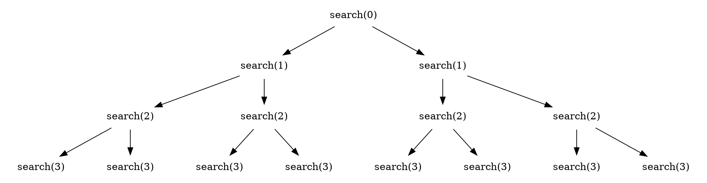

# Generating subsets

We first consider the problem of generating
all subsets of a set of $n$ elements.
For example, the subsets of $\{0,1,2\}$ are
$\emptyset$, $\{0\}$, $\{1\}$, $\{2\}$, $\{0,1\}$,
$\{0,2\}$, $\{1,2\}$ and $\{0,1,2\}$.
There are two common methods to generate subsets:
we can either perform a recursive search
or exploit the bit representation of integers.

## Method 1

An elegant way to go through all subsets
of a set is to use recursion.
The following function `search`
generates the subsets of the set
$\{0,1,\ldots,n-1\}$.
The function maintains a vector `subset`
that will contain the elements of each subset.
The search begins when the function is called
with parameter 0.

```rust
# let mut subset = Vec::new();
# let n = 10;
fn search(k: usize, subset: &mut Vec<usize>, n: usize) {
    if k == n{
        // process subset
# println!("{:?}", &subset);
    } else {
        search(k+1, subset, n);
        subset.push(k);
        search(k+1, subset, n);
        subset.pop();
    }
}
# search(0, &mut subset, n);
```

When the function `search`
is called with parameter $k$,
it decides whether to include the
element $k$ in the subset or not,
and in both cases,
then calls itself with parameter $k+1$
However, if $k=n$, the function notices that
all elements have been processed
and a subset has been generated.

The following tree illustrates the function calls when $n=3$.
We can always choose either the left branch
($k$ is not included in the subset) or the right branch
($k$ is included in the subset).


## Method 2

Another way to generate subsets is based on
the bit representation of integers.
Each subset of a set of $n$ elements
can be represented as a sequence of $n$ bits,
which corresponds to an integer between $0 \ldots 2^n-1$.
The ones in the bit sequence indicate
which elements are included in the subset.

The usual convention is that
the last bit corresponds to element 0,
the second last bit corresponds to element 1,
and so on.
For example, the bit representation of 25
is 11001, which corresponds to the subset $\{0,3,4\}$.

The following code goes through the subsets
of a set of $n$ elements

```rust, ignore
let mut b = 0;
while b < 1<<n{
    //process subset
    b += 1
}
```

The following code shows how we can find
the elements of a subset that corresponds to a bit sequence.
When processing each subset,
the code builds a vector that contains the
elements in the subset.

```rust
# let n = 10;
let mut b = 0;
while b < 1<<n{
    let mut subset = Vec::new();
    for i in 0..n {
        if b & (1<<i) != 0 {
            subset.push(i);
        }
    }
# println!("{subset:?}");
    b += 1;
}
```
that can be shortened as:

```rust
# let n = 10;
for b in 0..1 << n{
    let subset: Vec<usize> = (0..n).filter(|&i| b&(1<<i)!=0).collect();
# println!("{subset:?}");
}
```
