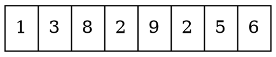
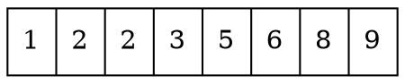
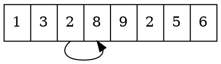
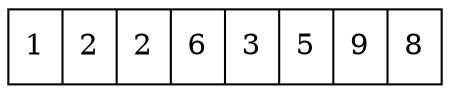
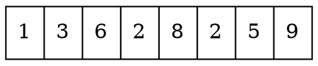
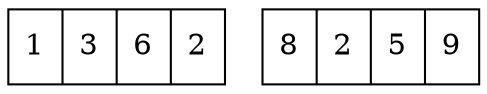
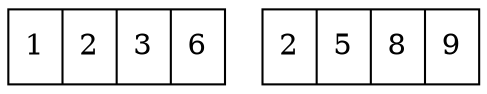
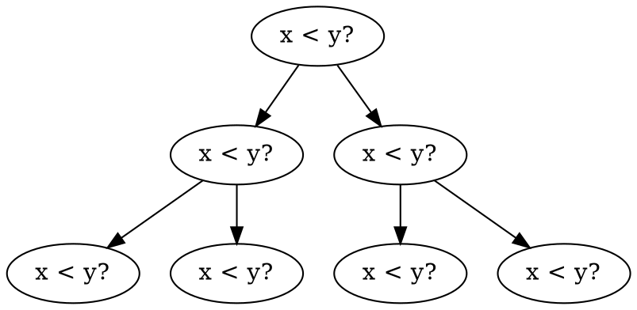
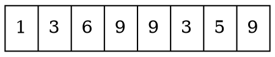
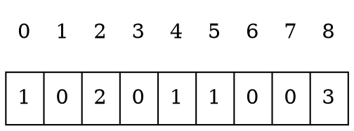

# Sorting

The basic problem in sorting is as follows:

> Given an array that contains $n$ elements, your task is to sort the elements in increasing order.

For example, the array



will be as follows after sorting:



## $O(n^2)$ algorithms

### Bubble sort

Simple algorithms for sorting an array
work in $O(n^2)$ time.
Such algorithms are short and usually
consist of two nested loops.
A famous $O(n^2)$ time sorting algorithm
is **bubble sort** where the elements
_bubble_ in the array according to their values.

Bubble sort consists of $n$ rounds.
On each round, the algorithm iterates through
the elements of the array.
Whenever two consecutive elements are found
that are not in correct order,
the algorithm swaps them.
The algorithm can be implemented as follows:
```rust
# use std::mem::swap;
# let mut array = [1, 3, 8, 2, 9, 2, 5, 6];
# let n = array.len();
# println!("Before: {array:?}");
for i in 0..n {
    for j in 0..n-1 {
        if (array[j] > array[j+1]) {
            array.swap(j, j+1); //swap the j-th element with the j+1-th element
        }
    }
}
# println!("After:  {array:?}");
```

After the first round of the algorithm,
the largest element will be in the correct position,
and in general, after $k$ rounds, the $k$ largest
elements will be in the correct positions.
Thus, after $n$ rounds, the whole array
will be sorted.

For example, in the array


the first round of bubble sort swaps elements as follows:



### Inversion

Bubble sort is an example of a sorting
algorithm that always swaps _consecutive_
elements in the array.
It turns out that the time complexity
of such an algorithm is _always_
at least $O(n^2)$, because in the worst case,
$O(n^2)$ swaps are required for sorting the array.

A useful concept when analyzing sorting
algorithms is an **inversion**:
a pair of array elements
`(array[a],array[b])` such that
`a<b` and `array[a]>array[b]`,
i.e., the elements are in the wrong order.
For example, the array



has three inversions: $(6,3)$, $(6,5)$ and $(9,8)$.
The number of inversions indicates
how much work is needed to sort the array.
An array is completely sorted when
there are no inversions.
On the other hand, if the array elements
are in the reverse order,
the number of inversions is the largest possible:

$$
1+2+\cdots+(n-1)=\frac{n(n-1)}{2} = O(n^2)
$$

Swapping a pair of consecutive elements that are
in the wrong order removes exactly one inversion
from the array.
Hence, if a sorting algorithm can only
swap consecutive elements, each swap removes
at most one inversion, and the time complexity
of the algorithm is at least $O(n^2)$.

## $O(n \log n)$ algorithms

### Merge sort

It is possible to sort an array efficiently
in $O(n \log n)$ time using algorithms
that are not limited to swapping consecutive elements.
One such algorithm is **merge sort** which is based on recursion.

Merge sort sorts a subarray `array[a..b]` as follows:

- If $a=b$, do not do anything, because the subarray is already sorted.
- Calculate the position of the middle element: $k=\lfloor (a+b)/2 \rfloor$.
- Recursively sort the subarray `array[a..k]`.
- Recursively sort the subarray `array[k+1..b]`.
- _Merge_ the sorted subarrays `array[a..k)` and `array(k+1..b]` into a sorted subarray `array[a..b]`.

Merge sort is an efficient algorithm, because it
halves the size of the subarray at each step.
The recursion consists of $O(\log n)$ levels,
and processing each level takes $O(n)$ time.
Merging the subarrays `array[a..k]` and `array[k+1..b]`
is possible in linear time, because they are already sorted.


The array will be divided into two subarrays as follows:


Then, the subarrays will be sorted recursively as follows:


Finally, the algorithm merges the sorted subarrays and creates the final
sorted array:


## Sorting lower bound

Is it possible to sort an array faster
than in $O(n \log n)$ time?
It turns out that this is _not_ possible
when we restrict ourselves to sorting algorithms
that are based on comparing array elements.

The lower bound for the time complexity
can be proved by considering sorting
as a process where each comparison of two elements
gives more information about the contents of the array.
The process creates the following tree:



Here $x<y?$ means that some elements
$x$ and $y$ are compared.
If $x<y$, the process continues to the left,
and otherwise to the right.
The results of the process are the possible
ways to sort the array, a total of $n!$ ways.
For this reason, the height of the tree
must be at least
$$ \log_2(n!) = \log_2(1)+\log_2(2)+\cdots+\log_2(n)$$
We get a lower bound for this sum
by choosing the last $n/2$ elements and
changing the value of each element to $\log_2(n/2)$.
This yields an estimate
$$ \log_2(n!) \ge (n/2) \cdot \log_2(n/2),$$
so the height of the tree and the minimum
possible number of steps in a sorting
algorithm in the worst case
is at least $n \log n$.

## Counting sort

The lower bound $n \log n$ does not apply to
algorithms that do not compare array elements
but use some other information.
An example of such an algorithm is
\key{counting sort} that sorts an array in
$O(n)$ time assuming that every element in the array
is an integer between $0 \ldots c$ and $c=O(n)$.

The algorithm creates a _bookkeeping_ array,
whose indices are elements of the original array.
The algorithm iterates through the original array
and calculates how many times each element
appears in the array.

For example, the array


corresponds to the following bookkeeping array:


For example, the value at position 3
in the bookkeeping array is 2,
because the element 3 appears 2 times
in the original array.

Construction of the bookkeeping array
takes $O(n)$ time. After this, the sorted array
can be created in $O(n)$ time because
the number of occurrences of each element can be retrieved
from the bookkeeping array.
Thus, the total time complexity of counting
sort is $O(n)$.

Counting sort is a very efficient algorithm
but it can only be used when the constant $c$
is small enough, so that the array elements can
be used as indices in the bookkeeping array.

___

[^1] According to [47], merge sort was invented by J. von Neumann in 1945
